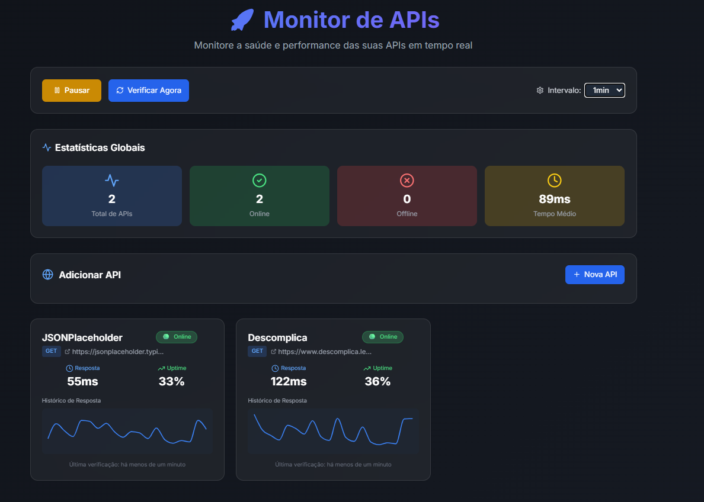

# 🚀 Monitor de APIs

Um sistema completo para monitoramento de APIs em tempo real, desenvolvido com Next.js e TypeScript. Monitore o status, tempo de resposta e disponibilidade das suas APIs favoritas de forma simples e eficiente.



## ✨ Funcionalidades

- 📊 **Monitoramento em tempo real** - Acompanhe o status das suas APIs constantemente
- ⚡ **Medição de tempo de resposta** - Veja a performance das APIs em milissegundos
- 🎯 **Status customizável** - Configure códigos de status esperados para cada API
- 🔄 **Proxy integrado** - Resolve problemas de CORS automaticamente
- 📱 **Interface responsiva** - Funciona perfeitamente em desktop e mobile
- 🎨 **Design moderno** - Interface limpa e intuitiva
- 🔧 **Configuração flexível** - Adicione headers customizados e payloads
- ⏱️ **Timeout configurável** - Defina limites de tempo para cada endpoint

## 🛠️ Tecnologias Utilizadas

- **Framework**: Next.js 14
- **Linguagem**: TypeScript
- **Estilização**: Tailwind CSS
- **Icons**: Lucide React
- **Arquitetura**: Pages Router / App Router

## 🚀 Como usar

### Pré-requisitos

- Node.js 18+ instalado
- npm ou yarn

### Instalação

1. Clone o repositório:

```bash
git clone <url-do-repositorio>
cd monitor-apis
```

2. Instale as dependências:

```bash
npm install
# ou
yarn install
```

3. Execute o projeto:

```bash
npm run dev
# ou
yarn dev
```

4. Acesse no navegador:

```
http://localhost:3000
```

## 🏗️ Estrutura do Projeto

```
api-monitor/
├── package.json
├── next.config.js
├── tailwind.config.js
├── tsconfig.json
├── src/
│   ├── app/
│   │   ├── layout.tsx
│   │   ├── page.tsx
│   │   └── globals.css
│   ├── components/
│   │   ├── ApiCard.tsx
│   │   ├── ApiForm.tsx
│   │   ├── Dashboard.tsx
│   │   ├── GlobalStats.tsx
│   │   ├── ResponseChart.tsx
│   │   └── StatusBadge.tsx
│   ├── hooks/
│   │   ├── useApiMonitor.ts
│   │   └── useLocalStorage.ts
│   ├── types/
│   │   └── api.ts
│   └── utils/
│       ├── apiChecker.ts
│       └── formatters.ts
```

### Configurar intervalos de monitoramento

```typescript
// Monitoramento a cada 30 segundos
setInterval(() => {
  apis.forEach(api => apiChecker.checkAPI(api));
}, 30000);
```

## 🐛 Resolução de Problemas

### Erro de CORS

O projeto inclui um proxy automático que resolve problemas de CORS. Se ainda assim houver problemas, verifique se a API de destino permite requisições externas.

### Timeout nas requisições

Aumente o valor do timeout na configuração da API:

```typescript
{
  timeout: 30000; // 30 segundos
}
```

### Erro 500 no proxy

Verifique os logs no console do servidor (`npm run dev`) para identificar o problema específico.

## 📊 Interpretando os Resultados

- 🟢 **Verde**: API funcionando normalmente
- 🟡 **Amarelo**: API respondeu, mas com status inesperado
- 🔴 **Vermelho**: API com erro ou fora do ar
- ⏱️ **Timeout**: API não respondeu dentro do tempo limite

## 📝 Exemplos de APIs para Testar

```typescript
// APIs públicas para teste
const apisExemplo = [
  {
    id: 'jsonplaceholder',
    url: 'https://jsonplaceholder.typicode.com/posts/1',
    method: 'GET',
    expectedStatus: 200,
  },
  {
    id: 'httpbin-get',
    url: 'https://httpbin.org/get',
    method: 'GET',
    expectedStatus: 200,
  },
];
```
